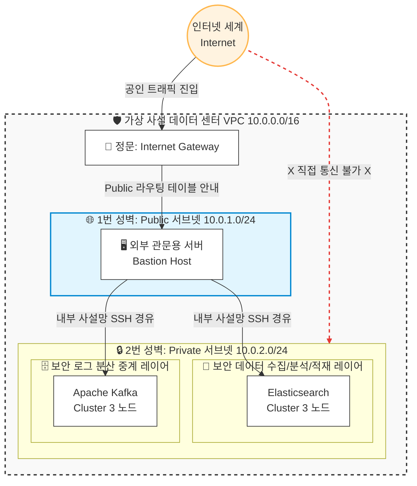

# 🚀 Automated Security Data Platform Infrastructure on AWS

> **Terraform(IaC)과 Ansible을 활용하여 AWS 가상 사설망 내에 보안 로그 수집 및 분석을 위한 고가용성(HA) 데이터 파이프라인 플랫폼(Self-Managed Apache Kafka & Elastic Stack)을 완전 자동화된 프로세스로 구축하는 엔지니어링 프로젝트입니다.**

---

## 🎯 1. 프로젝트 목적 & 기획 의도 (Project Objectives)

본 프로젝트는 인프라 수준의 자동화를 넘어, **대규모 인프라 및 대고객 서비스에서 발생하는 대용량 보안 로그 및 트래픽 데이터를 안정적으로 수집, 중계, 분석하기 위한 플랫폼 뼈대를 구축**하는 것을 목적으로 합니다. 

* **보안 데이터 수집 파이프라인 실증:** 외부 위협 및 내부 이상 행위 탐지의 기반이 되는 로그 연동을 위해 고가용성 분산 버퍼(Kafka)와 분산 검색 엔진(Elasticsearch) 인프라를 유기적으로 결합합니다.
* **Self-Managed 오픈소스 운영 역량 내재화:** 매니지드 서비스(Managed Service)에 의존하지 않고, 직접 리눅스 환경 위에서 오픈소스 클러스터를 아키텍처 수준부터 제어하여 장애 대응력과 비용 통제력을 극대화합니다.
* **IaC 및 Configuration Management의 결합:** Terraform을 통한 선언적 프로비저닝과 Ansible을 통한 이상 탐지 환경 구성을 한 축으로 엮어 인프라 운영 자동화 및 시나리오 배포의 유연성을 확보합니다.

---

## 🏗️ 2. 핵심 아키텍처 (Architecture Overview)

본 인프라는 **제로 트러스트(Zero Trust) 망 분리 원칙**을 철저히 준수하여 설계되었습니다. 외부 인터넷과의 접점을 최소화하고 대용량 데이터 버퍼 및 검색 엔진을 안전하게 격리 구역에 배치했습니다.

### 🌐 네트워크 & 가상 방화벽 토폴로지
*상세한 네트워크 설계 당위성은 [VPC 아키텍처 백서(docs/ARCHITECTURE.md)](docs/ARCHITECTURE.md)에서 확인할 수 있습니다.*



---

## 🛠️ 3. 핵심 엔지니어링 성과 (Key Achievements)

### ① 선언적 인프라 및 가상 방화벽 완전 자동화 (IaC)
* **Terraform**을 활용하여 단 한 번의 명령어(`terraform apply`)로 VPC, 라우팅 테이블, 보안 그룹, EC2 인스턴스 4대를 유기적으로 엮어내며 인프라 프로비저닝 시간을 분 단위로 단축하고 휴먼 에러를 100% 제거했습니다.
* 변수 최적화(`variables.tf`) 및 동적 환경 태깅을 통해 단일 코드로 개발(Dev) 환경과 운영(Prod) 환경을 쉽게 전환 및 복제할 수 있도록 가용성을 확보했습니다.

### ② 연쇄 보안 그룹(Chained Security Group) 및 인바운드 통제
* Private 서브넷 내부 노드들의 보안 극대화를 위해 외부 인터넷 진입로를 완벽히 격리했습니다.
* SSH(22번) 접속은 오직 Public 서브넷에 상주하는 Bastion Host의 특정 보안 그룹 ID(`bastion_sg`)를 통과한 패킷만 연쇄적으로 허용하도록 설정하여 침투 경로를 1개로 한정했습니다.
* **SSH Agent Forwarding** 기법을 적용하여 외부 관문 서버(Bastion) 내부에 마스터 비밀 열쇠(`Private Key`)를 절대 저장하지 않는 상용 인프라 급의 보안 표준을 구현했습니다.

### ③ FinOps 기반의 3노드 분산 환경 비용 최적화
* AWS 프리티어 계정의 단일 계정 스토리지 제한(30GB) 내에서 3노드 고가용성 분산 플랫폼 실증을 위해, 각 EC2 인스턴스의 EBS Root Volume 크기를 최소 규격인 8GB(총 32GB)로 정밀 정량 산정했습니다.
* IaC의 핵심 장점인 단일 명령어 철거 메커니즘(`terraform destroy`)을 활용한 **'On-Demand 테스트 전략'**을 수행하여, 실질적인 인프라 유지 누적 사용량(GB-month)을 허용 범위의 10% 미만으로 통제하며 초과 청구 비용을 0원으로 방어했습니다.

---

## 📂 4. 프로젝트 디렉토리 구조 (Directory Structure)

```text
automated-ha-cluster-ops/
├── README.md               # 본 프로젝트 메인 기술 명세서
├── terraform/              # ✨ Terraform 인프라 자동화 코드 구역
│   ├── providers.tf        # AWS 프로바이더 및 최소 요구 버전 명세
│   ├── variables.tf        # 비용 및 리전 설정을 통제하는 변수 관리자
│   └── main.tf             # VPC, 서브넷, 가상 방화벽 및 EC2 정의서
└── docs/                   # ✨ 상세 기술 백서 저장소
    └── ARCHITECTURE_VPC.md # VPC 사설망 격리 및 라우팅 설계 상세 백서
```

---

## 🚀 5. 시작 가이드 (Quick Start)

### 사전 요구사항
* Terraform `>= 1.0.0`
* AWS CLI v2 가동 및 IAM Credential 연동 완료

### 인프라 가동 및 제거 명령어
```bash
# 1. 워크스페이스 디렉토리 이동
cd terraform/

# 2. 프로바이더 플러그인 초기화
terraform init

# 3. 실물 인프라 배포 (계정 내 자원 자동 생성)
terraform apply -auto-approve

# 4. 실습 완료 후 자원 즉시 완전 철거 (비용 0원 방어)
terraform destroy -auto-approve
```

---

## 🔒 6. 데이터 플랫폼 보안 표준 가이드라인 (Security Baseline)

본 프로젝트의 모든 가상 머신(EC2) 접속 및 분산 플랫폼 간 통신은 상용 가이드라인을 충족하도록 설계되었습니다.

1. **외부 노출 원천 차단:** 대용량 로그 버퍼(Kafka)와 데이터 적재/분석 레이어(Elasticsearch)가 포함된 총 3대의 클러스터 노드는 공인 IP가 할당되지 않은 `Private Subnet`에 완벽히 은닉되어 있습니다.
2. **징검다리(Jump Host) 아키텍처:** 관리 목적의 SSH(22) 인바운드는 오직 `Public Subnet`의 문지기 서버(`Bastion Host`)를 통해서만 인가된 트래픽을 경유 처리합니다.
3. **SSH 키 보관소 최적화 (Agent Forwarding):** `Bastion Host` 서버 내부에 민감한 비밀 열쇠(`my-cluster-key`) 실물을 절대로 업로드하여 저장하지 않고, 로컬의 `ssh-agent` 권한을 포워딩 기법으로 위임하여 열쇠 탈취 위협을 물리적으로 제거했습니다.

---

## 📊 7. 향후 확장 로드맵 (Roadmap)

- [ ] **Phase 1:** Terraform 기반의 VPC 망 분리 및 4-Node 가상 인프라 자동화 프로비저닝 수립
- [ ] **Phase 2:** Ansible Playbook을 활용한 복수 노드 내 Self-Managed Apache Kafka 분산 버퍼 레이어 무중단 구축
- [ ] **Phase 3:** Elastic Stack 파이프라인 연동을 통한 인프라 및 보안 로그 수집/이상 탐지 시나리오 모니터링 환경 실증
