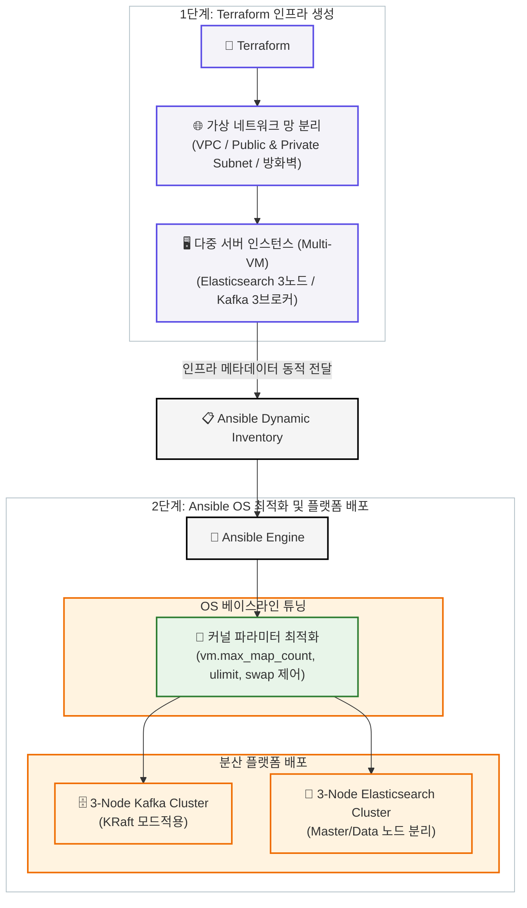

# ⚙️ IaC 기반 분산 데이터 플랫폼 인프라 자동 구축 및 OS 커널 최적화 프로젝트

본 프로젝트는 수작업 인프라 구축 시 발생하는 **휴먼 에러와 환경 불일치 문제를 해결**하기 위해, **Terraform**으로 고가용성(HA) 다중 노드 네트워크를 프로비저닝하고 **Ansible**로 리눅스 커널 최적화 및 분산 플랫폼 배포를 100% 자동화한 실무형 인프라 프로젝트입니다.

---

## 🏗️ 1. 인프라 아키텍처 및 자동화 흐름



---

## 🛠️ 2. 핵심 문제 해결 및 구현 성과 (STAR)

### ① 대규모 가상 서버 수작업 구축 시의 리소스 낭비 및 휴먼 에러
* **문제 상황 (Situation & Task)**
  * 대용량 데이터를 처리하기 위해 Elasticsearch 3노드, Kafka 3브로커 등 총 8~10대 규모의 고가용성 분산 플랫폼 인프라가 필요한 상황.
  * 이를 GUI(콘솔) 화면에서 수작업으로 서버를 만들고 네트워크/방화벽을 설정할 경우, **구축 시간이 수 시간 이상 소요**되며 서버 간 **설정 불일치(Configuration Drift) 및 보안 포트 개방 오류 등의 휴먼 에러 리스크**가 존재함.
* **해결 방안 (Action)**
  * **Terraform(IaC)을 도입**하여 VPC, 퍼블릭/프라이빗 서브넷, 최소 보안 포트만 허용하는 보안 그룹(Security Group) 및 다중 VM 인스턴스 생성을 **선언적 코드로 자산화**.
  * 인프라 프로비저닝 완료 후 가변적인 서버 IP 정보를 **Ansible Dynamic Inventory와 연동**하여 후속 설정 파이프라인으로 매끄럽게 연결되도록 자동화함.
* **구체적 결과 (Result)**
  * 복잡한 다중 노드 네트워크 및 인프라 빌드 타임(RTO)을 **단 10분 내외로 획기적으로 단축**.
  * 인프라를 코드로 관리함으로써 동일 규격의 개발/스테이징/운영 환경을 버튼 하나로 완벽히 복제하여 **환경 불일치 가능성을 0%로 차단**.

### ② 분산 검색 엔진(Elasticsearch) 가동 시 OS 레벨 병목 및 크래시 위험
* **문제 상황 (Situation & Task)**
  * 순정 상태의 리눅스 가상 서버에 Elasticsearch 클러스터를 그대로 배포할 경우, 대규모 데이터 인덱싱/검색 시 가상 메모리 부족 오류(`OOM`)나 파일 디스크립터 한도 초과로 인해 **노드가 강제 다운되는 안정성 리스크**가 있음.
* **해결 방안 (Action)**
  * **Ansible Role 체계를 구축**하여 서버 기동 즉시 하부 리눅스 OS의 베이스라인을 대용량 데이터 처리에 맞게 자동 튜닝하도록 공통 플레이북 작성.
  * 리눅스 커널 파라미터 설정을 자동화하여 시스템 메모리 맵 한도(`sysctl -w vm.max_map_count=262144`)를 영구 상향하고, 프로세스당 최대 오픈 파일 개수(`ulimit -n 65535`)를 자동으로 확장하도록 구성함.
* **구체적 결과 (Result)**
  * 수십 대의 서버 리눅스 설정을 단 한 번의 명령어로 동시 적용하여 **운영체제 레벨의 병목 및 노드 크래시 현상을 미연에 방지**.
  * 검색 엔진의 운영 요구 조건을 완벽히 충족하는 **생산 환경 규격의 리눅스 베이스라인 확보**.

### ③ 분산 아키텍처의 의존성 복잡도로 인한 인프라 운영 비용 증가
* **문제 상황 (Situation & Task)**
  * 분산 메시지 큐인 Apache Kafka를 클러스터링하기 위해 과거 레거시 방식인 Zookeeper 코디네이터를 별도로 구축할 경우, 관리해야 하는 오픈소스 컴포넌트와 VM 수가 늘어나 고스란히 **인프라 유지 비용 및 모니터링 공수가 가중됨**.
* **해결 방안 (Action)**
  * Zookeeper 의존성이 완벽히 제거된 최신 Kafka의 **KRaft(Zookeeper-less) 모드를 아키텍처에 과감히 채택**.
  * 메타데이터 관리를 Kafka 브로커 자체 내에서 수행하도록 Ansible 템플릿 엔진(`Jinja2`)을 활용하여 분산 제어 쿼럼(Quorum) 및 ID 설정을 서버별로 동적 바인딩하여 일괄 배포함.
* **구체적 결과 (Result)**
  * 불필요한 코디네이터 레이어 서버를 줄여 **인프라 컴퓨팅 자원 및 관리 포인트를 감축**.
  * 아키텍처의 복잡성을 낮추어 고장 점(SPOF)을 최소화하고 플랫폼 운영 효율성 향상.

---

## 🚀 3. 아키텍처 자동 빌드 가이드 (Quick Start)

### 1단계: 가상 인프라 자원 프로비저닝 (Terraform)
```bash
# 1. Terraform 워크스페이스 이동 및 프로바이더 초기화
cd terraform/
terraform init

# 2. 인프라 자원 실행 계획 확인 및 일괄 생성
terraform plan
terraform apply -auto-approve
```

### 2단계: OS 최적화 및 분산 클러스터링 배포 (Ansible)
```bash
# 1. Ansible 워크스페이스 이동
cd ../ansible/

# 2. 가상 노드 전체에 커널 최적화 및 분산 플랫폼 배포 실행
ansible-playbook site.yml
```
