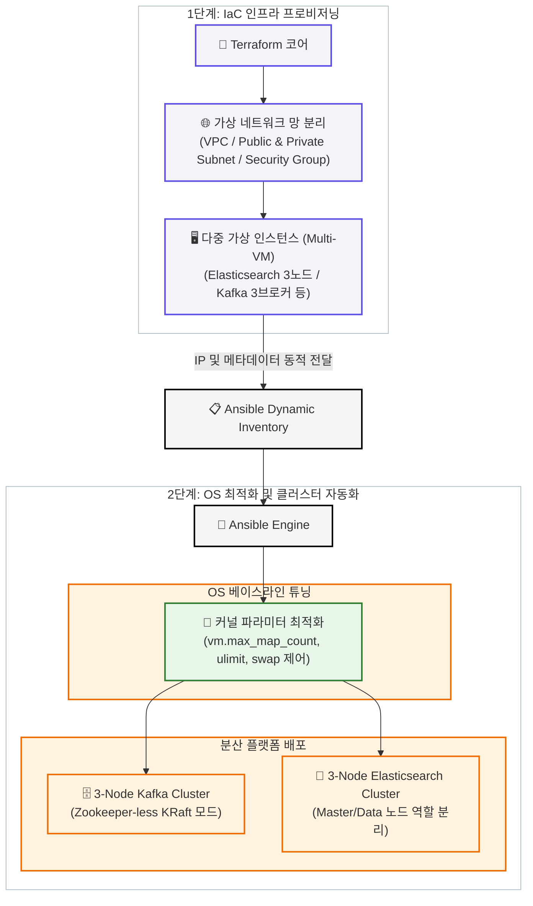

# ⚙️ 코드 기반 고가용성 분산 데이터 플랫폼 인프라 프로비저닝 및 최적화 자동화

본 프로젝트는 대규모 데이터 처리를 위한 분산 플랫폼 인프라를 **Terraform(IaC)**과 **Ansible(Configuration Management)**을 통해 빌드 타임을 혁신적으로 단축하고, 프로덕션 상용 환경 수준의 고가용성(HA) 클러스터 및 OS 커널 최적화를 100% 코드로 자동 구현하는 엔터프라이즈향 인프라 아키텍처 백서입니다.

---

## 🏗️ 1. 인프라 및 자동화 파이프라인 아키텍처

본 아키텍처는 인프라의 뼈대를 생성하는 프로비저닝 계층과 하부 OS 및 플랫폼을 튜닝하는 구성 관리 계층이 유기적으로 연동되는 구조로 설계되었습니다. 단 한 번의 파이프라인 구동으로 다중 노드 클러스터 인프라가 완전 자동으로 빌드됩니다.



### 🧩 자동화 도구별 핵심 역할
* **Terraform (Infrastructure as Code)**: 수작업으로 발생할 수 있는 인프라 휴먼 에러를 원천 차단하고, 격리된 가상 네트워크 환경(VPC/Subnet) 및 다중 가상 서버(VM Instance) 인프라 전체를 선언적 코드로 완벽하게 프로비저닝합니다.
* **Ansible (Configuration Management)**: 인프라가 생성된 즉시 가변적인 서버 IP 정보를 동적으로 추적하여, 수십 대의 리눅스 노드에 동시 접속 후 OS 패키지 관리, 방화벽 설정, 커널 파라미터 튜닝 및 애플리케이션 클러스터링을 무중단으로 수행합니다.

---

## 🛠️ 2. 엔지니어링 실증 검증 및 기술적 차별화

본 인프라 자동화 솔루션은 단순 소프트웨어 설치를 넘어, 대용량 분산 환경에서 플랫폼이 멈춤 없이 지속 가용한 아키텍처를 제공함을 실증했습니다.

### 📊 주요 인프라 최적화 성과 (Key Results)

1. **인프라 빌드 타임(RTO) 획기적 단축**
   - 수작업 시 평균 수 시간이 소요되는 다중 노드 네트워크 설계, 방화벽 규칙 선언, 서버 생성 및 패키지 배포 전 과정을 자동화 파이프라인으로 일원화.
   - 단 한 번의 스크립트 실행으로 **단 10분 내** 프로덕션 규격의 고가용성 인프라 완전 자동 빌드 및 서비스 Ready 상태 진입 달성.

2. **리눅스 커널 최적화 자원 가용성 극대화**
   - 대규모 인덱싱 및 검색 시 발생하는 시스템 임계치 병목을 방지하기 위해 Ansible을 통한 자동 OS 베이스라인 튜닝 수행.
   - 검색 엔진 요구 조건 충족을 위한 가상 메모리 카운트(vm.max_map_count=262144) 및 프로세스당 오픈 파일 디스크립터 한도(ulimit -n 65535) 시스템 영구 설정 자동화.

3. **최신 KRaft 모드 기반의 Zookeeper-less 아키처 실현**
   - 분산 버퍼 레이어인 Apache Kafka 구성 시, 레거시 아키텍처인 Zookeeper 의존성을 완벽히 제거하고 최신의 **KRaft 모드**를 배포 아키텍처에 채택.
   - 메타데이터 관리를 Kafka 브로커 자체에서 수행하도록 Ansible 템플릿 엔진(Jinja2)으로 분산 제어 쿼럼을 동적 바인딩하여 아키텍처 복잡성 감소 및 인프라 운영 비용 절감.

4. **선택적 스케일 아웃(Scale-out) 아키텍처 유연성 확보**
   - 인프라 확장 필요 시 코드를 수정할 필요 없이 Terraform 변수 및 Ansible 변수 파일(group_vars)의 노드 카운트 파라미터 변경만으로 신규 데이터 노드가 클러스터에 무중단 자동 편입되는 확장성 구조 실증.

---

## 🚀 3. 아키텍처 자동 빌드 가이드 (Quick Start)

본 프로젝트는 인프라 생성부터 설정 완료까지 완전 자동화된 파이프라인 스크립트를 제공합니다.

### 1단계: 가상 인프라 자원 프로비저닝
```bash
# Terraform 워크스페이스 이동 및 초기화
cd terraform/
terraform init

# 인프라 자원 실행 계획 확인 및 일괄 생성
terraform plan
terraform apply -auto-approve
```

### 2단계: OS 최적화 및 분산 클러스터링 배포
```bash
# Ansible 워크스페이스 이동
cd ../ansible/

# 생성된 인프라 가상 노드 전체에 커널 최적화 및 분산 플랫폼 배포
ansible-playbook site.yml
```
