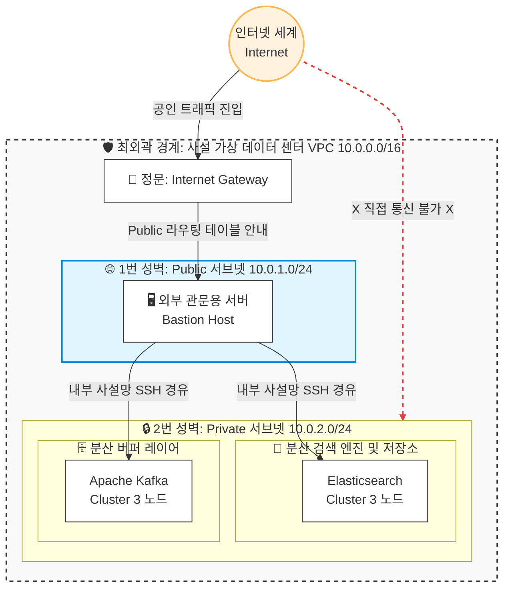

# 🌐 Network Architecture: VPC 사설망 격리 및 라우팅 설계 백서

본 문서는 대용량 데이터 플랫폼 인프라의 가용성과 보안성을 확보하기 위해 **Terraform(IaC)**으로 구현한 가상 네트워크(VPC) 및 서브넷 격리 아키텍처의 설계 당위성과 세부 명세를 기록한 기술 백서입니다.

---

## 🏗️ 1. 네트워크 토폴로지 (Network Topology)



---

## 🛡️ 2. 아키텍처 설계 의도 및 보안 당위성

### ① 제로 트러스트(Zero Trust) 기반의 망 분리
* **설계 목적**: 분산 저장소(Elasticsearch)와 메시지 큐(Kafka)는 기업의 중요 원본 데이터와 인프라 메타데이터를 담고 있으므로 외부 인터넷 환경에 노출될 경우 스캐닝 및 무차별 대입 공격의 타깃이 됩니다.
* **구현 핵심**: 
  * 외부와 소통하는 관문 구역인 **Public Subnet(`10.0.1.0/24`)**과 내부 격리 구역인 **Private Subnet(`10.0.2.0/24`)**을 물리적으로 분리했습니다.
  * Private 서브넷은 외부 인터넷 정문(Internet Gateway)으로 향하는 이정표가 라우팅 테이블에 존재하지 않으므로, 외부 공격자가 직접 사설 IP 주소로 패킷을 주입하는 행위가 구조적으로 불가능합니다.

### ② 명확한 네트워크 컴포넌트 역할 정의
* **VPC (`10.0.0.0/16`)**: AWS 공용 클라우드 환경 내에서 우리 인프라 자원만을 독점적으로 보호하는 거대한 논리적 사설 데이터 센터의 경계를 형성합니다.
* **Public Subnet**: 외부 관리자가 내부 인프라에 안전하게 접근하기 위한 유일한 경유지인 **Bastion Host(문지기 서버)**가 상주하는 영역입니다. `map_public_ip_on_launch = true` 옵션을 통해 외부 통신용 공인 IP를 자동 제어합니다.
* **Private Subnet**: 오직 내부 통신망 및 Bastion Host를 통한 내부 사설 라우팅으로만 접근 가능한 핵심 보안 구역입니다. **Kafka 브로커 3노드**와 **Elasticsearch 3노드**가 이 안전한 구역 내에서 상주하며 상호 통신을 수행합니다.

---

## 📊 3. 서브넷 및 주소 공간 할당 명세 (IP IPAM)

Terraform 자원의 확장성을 고려하여 CIDR 대역을 사전에 체계적으로 분할 지정했습니다.

| 서브넷 명칭 | 할당 CIDR 블록 | 가용 IP 개수 | 외부 인터넷 통신 여부 | 배치 자원 역할 |
| :--- | :--- | :--- | :--- | :--- |
| **VPC 기본 대역** | `10.0.0.0/16` | 65,536개 | 사설망 전체 경계 | 프로젝트 전용 가상 데이터 센터 |
| **Public Subnet** | `10.0.1.0/24` | 251개 | **가능 (In/Outbound)** | Bastion Host, 외부 인프라 관문 계층 |
| **Private Subnet** | `10.0.2.0/24` | 251개 | **불가 (내부 사설 통신만)** | Kafka Cluster, Elasticsearch Cluster |

---

## ⚙️ 4. 관련 인프라 선언 코드 (Terraform Reference)

본 아키텍처는 `terraform/main.tf` 파일의 선언적 코드를 통해 휴먼 에러 없이 동일한 규격으로 복제 및 제거가 가능합니다.

```hcl
# 가상 네트워크(VPC) 및 서브넷 핵심 선언부 예시

resource "aws_vpc" "main" {
  cidr_block           = "10.0.0.0/16"
  enable_dns_hostnames = true
}

resource "aws_subnet" "public" {
  vpc_id                  = aws_vpc.main.id
  cidr_block              = "10.0.1.0/24"
  map_public_ip_on_launch = true
}

resource "aws_subnet" "private" {
  vpc_id            = aws_vpc.main.id
  cidr_block        = "10.0.2.0/24"
}
```
