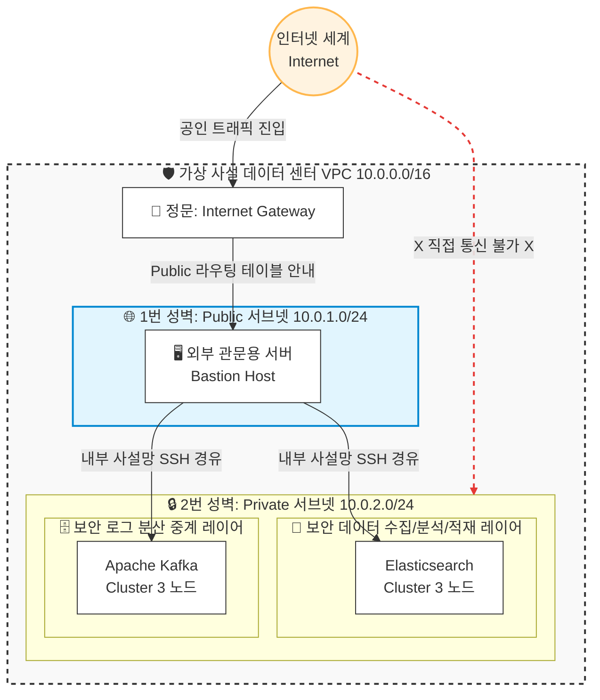

# 🛡️ AWS VPC Network Isolation & Routing Architecture Whitepaper

본 문서는 대규모 보안 로그 수집 및 분석을 위해 구축된 가상 사설 데이터 센터(VPC)의 네트워크 토폴로지와 트래픽 흐름, 그리고 보안 통제 설계 당위성을 기술합니다.

---

## 1. 네트워크 설계 요약 (Network Topology Overview)

본 인프라는 외부의 직접적인 공격 표면(Attack Surface)을 최소화하기 위해 **Public 구역(성문 역할)**과 **Private 구역(지하 벙커 역할)**을 물리적으로 격리하여 배치했습니다.

---

## 2. 서브넷 레이어별 상세 역할 정의 (Subnet Architecture)

### 🌐 ① Public Subnet (`10.0.1.0/24`)
* **역할:** 사설망 전체를 보호하는 외곽 성벽이자 공식적인 유일한 진입로입니다.
* **배치 자원:** 외부 관문용 문지기 서버인 `Bastion Host`가 배치됩니다.
* **통신 규칙:** `Internet Gateway(IGW)`와 연결된 라우팅 테이블을 사용하여 외부 인터넷과 양방향 공인 통신이 가능합니다. 가상 머신 생성 시 자동으로 공인 IP(Public IP)를 부여받습니다.

### 🔒 ② Private Subnet (`10.0.2.0/24`)
* **역할:** 철저하게 고립된 지하 벙커 구역으로, 비즈니스의 핵심 자산과 데이터 플랫폼이 상주합니다.
* **배치 자원:** Self-Managed 형태의 **Apache Kafka Cluster (3 노드)** 및 **Elasticsearch Cluster (3 노드)** 뼈대가 배치됩니다.
* **통신 규칙:** 공인 IP가 원천적으로 부여되지 않으며, 외부 인터넷에서 이 서브넷 영역의 사설 IP(`10.0.2.x`)로 직접 패킷을 던지는 것은 물리적으로 불가능합니다. 오직 Public Subnet을 경유한 사설 트래픽만 수용합니다.

---

## 3. 방화벽 전략 및 프로토콜 제어 명세 (Security Group Policy)

본 인프라는 포트 수준의 정밀 제어를 위해 가상 방화벽 세트인 보안 그룹(Security Group)을 연쇄 바인딩(Chained)하여 운용합니다.

| 분류 | 보안 그룹명 | 인바운드 규칙 (Inbound) | 아웃바운드 규칙 (Outbound) | 엔지니어링 의도 |
| :--- | :--- | :--- | :--- | :--- |
| **관문** | `bastion_sg` | • `Port 22 (SSH)` : `0.0.0.0/0` (전면 개방) | • `Protocol ALL (-1)` : `0.0.0.0/0` | 외부 관리자가 유일하게 진입할 수 있는 통로 개척 |
| **벙커** | `cluster_sg` | • `Port 22 (SSH)` : `bastion_sg` (Chained) • `Protocol ALL (-1)` : `self = true` | • `Protocol ALL (-1)` : `0.0.0.0/0` | 외부 진입을 차단하고, 내부 노드 간 대용량 데이터 셔틀 전면 허용 및 패키지 업데이트를 위한 아웃바운드 개방 |

### 💡 핵심 기술 요소: 프로토콜 `-1` (All Protocols) 지정 사유
`cluster_sg`에서 내부 노드 간 통신(`self = true`)과 아웃바운드(`egress`)의 프로토콜을 `-1`로 선언한 이유는 다음과 같습니다.
1. **분산 플랫폼의 다중 프로토콜 충족:** 분산 클러스터(Kafka, ES) 내부 노드 간의 상태 체크(Heartbeat)용 ICMP 핑 통신, UDP 메트릭 전송, TCP 데이터 동기화 등 다양한 프로토콜 요구사항을 방화벽 수준에서 유연하게 수용하기 위함입니다.
2. **패키지 다운로드 무결성:** 서버 내부에서 리눅스 업데이트 및 오픈소스 패키지 의존성을 가져올 때 프로토콜 제한으로 인해 다운로드가 차단되는 병목 현상을 원천 방어합니다.
